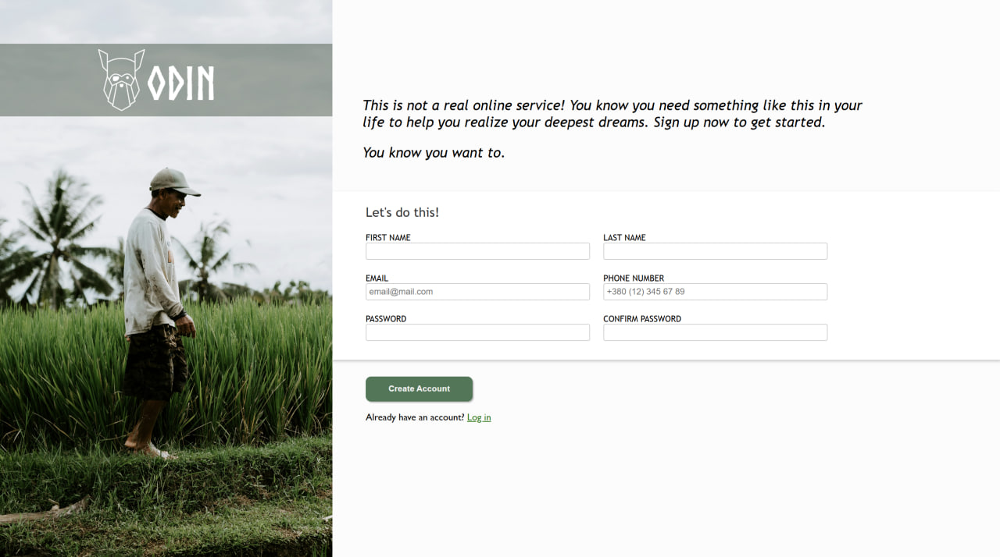

# Sign-up-Form
A simple user registration form built using HTML, CSS, and JavaScript.

# Screenshot

## What Project Does
With the registration form, the user can:
- Enter their first name, last name, email address, phone number, and password.
- Submit the form.
The form includes simple password validation.

## How to Use It
1. Open `index.html` in your web browser.
2. Fill out the form.
3. Click “Sign Up”.
This form doesn't save data to a server. It's for learning and practice Front end.

## Technologies Used
- HTML
- CSS
- JavaScript

## Credits
Created by Tetiana Sydorenko – August 2025
